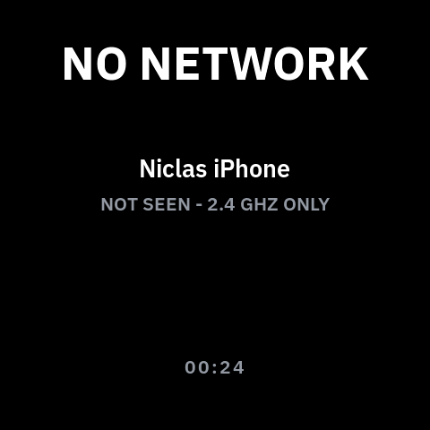
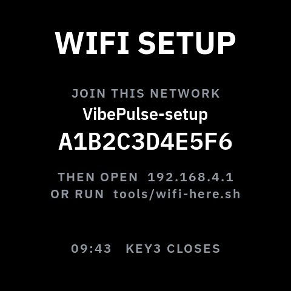

# WiFi on the road — how the panel follows you

The panel used to carry exactly two networks, both compiled into
`secrets.h`. A new place meant editing a header, rebuilding, and flashing
over USB — and OTA could not help, because OTA needs the network the panel
cannot reach. This is the reference for what replaced that.

## The short version

```
new place, panel finds nothing
        │
        ├─ 60 s ─► the glass says WHY (network hunted, radio's own reason)
        │
        ├─ 90 s ─► the panel raises VibePulse-setup and shows its password
        │          (a 3 s KEY3 hold opens the same window immediately)
        │
        ├─ from the Mac:    tools/wifi-here.sh        ← nothing to type
        └─ from a phone:    join the AP, portal opens ← type on a real keyboard
                │
                └─► remembered in NVS. Next time you are here, it just joins.
```

Six places are remembered. The one that worked most recently is tried
first, and the least recently working one is evicted when a seventh
arrives. The networks in `secrets.h` are appended underneath as an
**immutable floor**: the setup window can add places, never remove your
home network. That is what keeps a bad entry from turning into a USB
rescue.

<p align="center">
  
  &nbsp;
  
</p>
<p align="center"><em>Exact 480×480 simulator captures of the same LVGL overlay compiled into the panel firmware.</em></p>

## What actually changed on the road

Four things about travel that the old firmware got wrong:

| Before | Now |
|---|---|
| Two networks, compile-time | Six remembered in NVS + the compiled-in floor |
| `threshold.authmode = WIFI_AUTH_WPA2_PSK` for every network — open café networks were refused in silence | The threshold follows each network: open where the password is blank |
| No network → dashes forever, no reason anywhere | The glass names the network it is hunting and what the radio answered |
| A new place meant rebuild + USB flash | One command on the Mac, or a phone and the panel's own portal |

## The two ways in

### From the Mac — `tools/wifi-here.sh`

One command. It reads the Mac's current SSID, pulls that network's password
out of the **system keychain** (macOS prompts you — that prompt is the
consent), hops to the panel's access point, hands the credentials over, and
releases the Mac's WiFi. The Mac is offline for roughly twenty seconds.

The access point's password is **derived** from `TG_OTA_TOKEN` in
`secrets.h` — `sha256("vibepulse-softap-v1" + token)`, first 12 hex
characters — so the script computes it without reading anything off the
glass. This grants nothing new: whoever holds that token can already write
firmware to the panel. Without the token the password is random per window
and lives only on the screen; pass it in explicitly:

```sh
TG_AP_PASS=<what the glass shows> tools/wifi-here.sh
```

`test/test_wifi_setup_wiring.py` asserts the domain string, the digest
length and the AP name match between the firmware and the script. They
cannot drift apart silently.

### From a phone — the portal

Join `VibePulse-setup` with the password shown on the glass. The panel runs
a DNS responder that answers every query with its own address, so iOS and
Android pop the captive portal by themselves; if yours does not, open
`http://192.168.4.1/`. The page lists what the panel can see — **strongest
first, and it is the panel's radio that decides**, which is the whole point
when a phone shows five bars on a 5 GHz band the ESP32-S3 cannot hear.

## The consent model

The OTA window's three factors (physical presence, knowledge, time) are
unchanged. The setup window inherits two of them and deliberately relaxes
one:

1. **Physical presence** — the access point's password is on the glass.
   Whoever cannot see the screen (or hold `secrets.h` on their Mac) cannot
   get in.
2. **Time** — ten minutes, then it closes itself and hands back every byte
   it cost. The AP, the HTTP server and the DNS task do not exist outside
   an open window (the lazy-surface rule from the 2026-08-14 freeze).
3. **The window may open itself** after 90 s without an IP. This weakens
   nothing: with no network there is no remote that could have opened it,
   and a panel in a hotel room should not require knowing a secret gesture
   to become useful again.

**The setup window can never write firmware.** It touches the network list
in NVS and nothing else; OTA keeps its own gate and its own token. The
wiring test asserts no OTA symbol ever appears in `wifi_setup.c`.

### What KEY3 means now

A 3 s hold opens **the window that can actually help**:

- **With an IP** → the OTA maintenance window, exactly as before.
- **Without an IP** → the WiFi setup window. An OTA window with no network
  could never receive an upload anyway.

**Hold again to switch windows.** A second full 3 s hold while the update
window is open closes it and opens WIFI SETUP instead. That is how you
teach a panel that already *has* a network a new one — pre-loading the
phone hotspot at home before a trip, for instance — without waiting for it
to be stranded first. The port-80 handover is owned by the setup guard, so
the two HTTP servers never collide.

While either window owns the glass, *any* KEY3 release before three
seconds closes it — the same escape hatch the OTA window grew after
2026-08-16. Only a deliberate, completed hold switches; you cannot fail
to close by pressing.

## Where the credentials live

NVS, one blob, namespace `tgwifi`, key `slots`. One write, one commit — no
half-written list if power drops mid-save. A blob of the wrong size is
treated as empty rather than parsed at the wrong offsets, so an older or
newer format degrades to "run on the `secrets.h` floor" instead of
misreading.

**NVS is not encrypted.** The passwords sit in flash in the clear. That is
the same exposure `secrets.h` already had (the README says it plainly: a
lost screen leaks your WiFi password) — not a new class of risk, but the
reason a lost panel means rotating those networks. OTA never writes NVS, so
the list survives every update.

## What this does *not* fix

Being honest about travel networks, because the failure modes are not
firmware bugs:

- **Captive portals.** The panel cannot click "I agree". Most hotel and
  café networks stay out of reach no matter how easy joining them is.
- **Client isolation.** Plenty of guest networks block device-to-device
  traffic, so the panel associates fine and still cannot reach
  `your-mac.local:8737`.
- **WPA2-Enterprise.** Office and campus networks with a username are not
  handled.
- **5 GHz.** Still invisible to the ESP32-S3, forever. The setup portal's
  list is the panel's own truth about what exists.

**The network that always works on the road is the one you bring.** Turn on
the phone hotspot (iPhone: *Maximize Compatibility*, or it broadcasts only
5 GHz), put the Mac on it, and run `tools/wifi-here.sh` once. The panel
remembers the hotspot from then on and rejoins it in every city.

For the reachability half of these failure modes — the panel is *online*
but cannot reach the service across a network boundary — the relay
fallback exists (`TK_VIBEPULSE_RELAY_URL` in `secrets.h.example`): number
fetches fall back to a mailbox on the internet when the LAN service does
not answer. Panel-side only so far; inert until the service's publisher
ships.

## Physical verification status

Per `spec/hardware.md`'s rule about claiming hardware truth:

| Capability | Silicon | Board | Firmware | Verified on `torget-home-01` |
|---|---|---|---|---|
| 2.4 GHz station mode | yes | yes | yes | yes (2026-08-06) |
| SoftAP / APSTA | yes | yes | yes | **first run WEDGED the panel (2026-08-17)** |
| NVS read/write | yes | yes | yes | yes (boot-health probe) |

The warning this table used to carry — that the access point's cost to the
internal DMA heap was unmeasured — was borne out the first time the window
opened on the physical unit: the panel wedged twice (both after a KEY3
hold-hold during a post-OTA maintenance window) and was rolled back over
USB. Suspected mechanism: the AP + second HTTP server + DNS task starved
the flush's contiguous DMA block — the exact 2026-08-16 freeze anatomy —
but the serial log from the incident is the judge, not this guess.

Since then `window_open()` is bracketed by two host-tested DMA gates
(`tg_wifi_setup_dma_ok_to_open` / `_continue`): it refuses to open unless
the largest free DMA block clears 3x the flush (calibrated against the measured healthy baseline of 40-47 kB on v0.5.0), aborts and tears down if
the post-APSTA measurement falls under 2x, and logs the largest block at
every stage so the next incident names the hungry step. **The gates are
defensive, not a verification** — the setup window remains unproven on
hardware until a supervised run (serial monitor attached, USB recovery at
hand) passes with the DMA telemetry healthy.

## Files

| Path | What it owns |
|---|---|
| `components/torget_wifi/wifi_slots.c` | Pure policy: validation, eviction, candidate order, window timing. Host-tested. |
| `components/torget_wifi/wifi_form.c` | Pure parsing: percent-decoding, form fields, HTML escaping. Host-tested. |
| `components/torget_wifi/wifi_creds.c` | The NVS blob, and nothing else. |
| `components/torget_wifi/wifi_setup.c` | The window: AP, portal, DNS responder, guard task. |
| `components/torget_wifi/wifi_setup_ui.c` | The glass: the honest network screen and the setup screen. |
| `main/main.c` | Still owns the radio. Builds the candidate list, routes KEY3. |
| `tools/wifi-here.sh` | The Mac's one command. |
